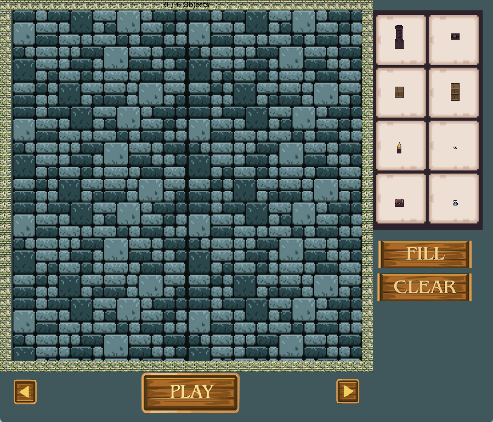
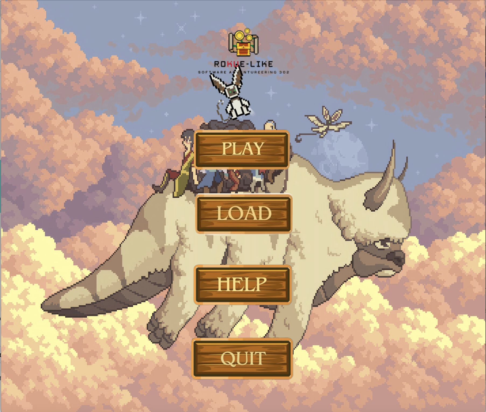
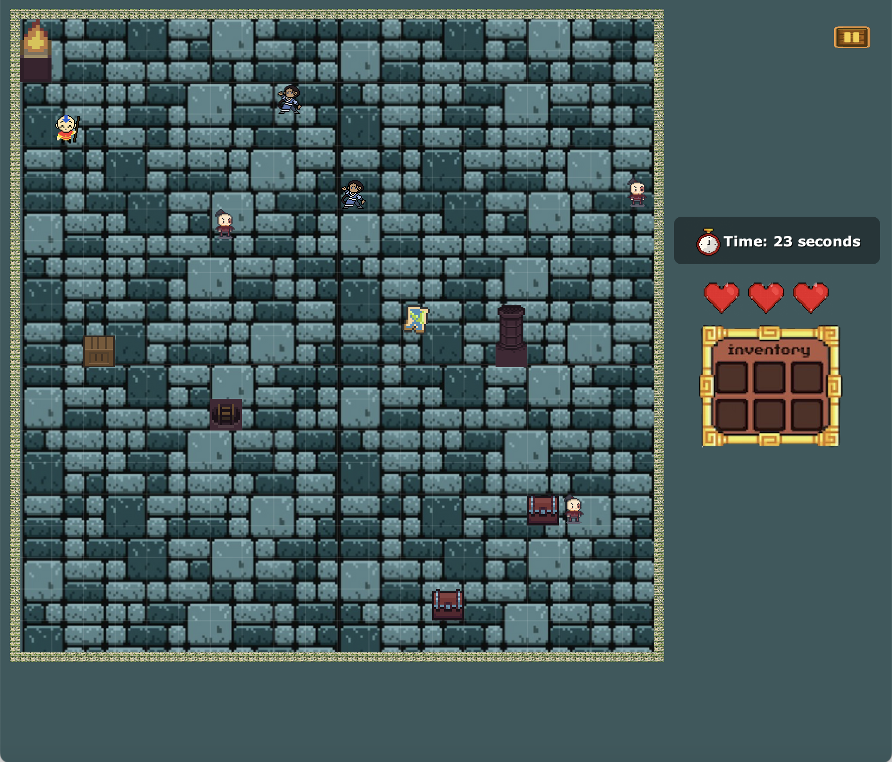

# RoKUe-Like

## Table of Contents
1. [Project Description](#project-description)
2. [Meet the Team!](#meet-the-team!)

---

## Project Description
RoKUe-Like is the Fall 2024 term project of COMP302: Software Engineering course at Koç University which is an adventurous rogue-like game. The hero must traverse various halls—Earth, Air, Water, and Fire—by finding hidden runes while avoiding monsters and using enchantments. The goal is to collect all runes and exit the dungeon before time runs out.

---

## Meet the Team!
We are **Team KURBAN: Koç University Rule-Based Arcade Nexus**, a dedicated group of six computer engineering students working together to bring the RoKUe-Like game to life.

- **Arda Cem Çakmak**: [acakmak19@ku.edu.tr](mailto:acakmak19@ku.edu.tr)
- **Ahmet Kutluğ Alperen Kars**: [akars20@ku.edu.tr](mailto:akars20@ku.edu.tr)
- **Emre Koç**: [ekoc20@ku.edu.tr](mailto:ekoc20@ku.edu.tr)
- **Elif Sude Arısoy**: [earisoy20@ku.edu.tr](mailto:earisoy20@ku.edu.tr)
- **Kazım Can**: [kcan21@ku.edu.tr](mailto:kcan21@ku.edu.tr)
- **Rana Ataseven**: [rataseven21@ku.edu.tr](mailto:rataseven21@ku.edu.tr)

---
